1.界面讲解
①能看到你目前是在本地还是再worktree，②能看到你当前所在的git分支
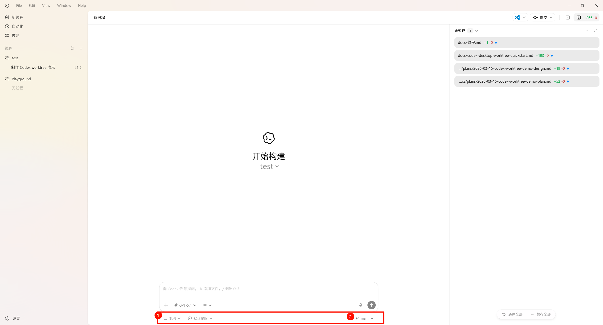

2.创建worktree
我一般会用的两种方式：
方式一：适用于没有历史对话信息要求。
直接点击左下角的按钮找到新工作树
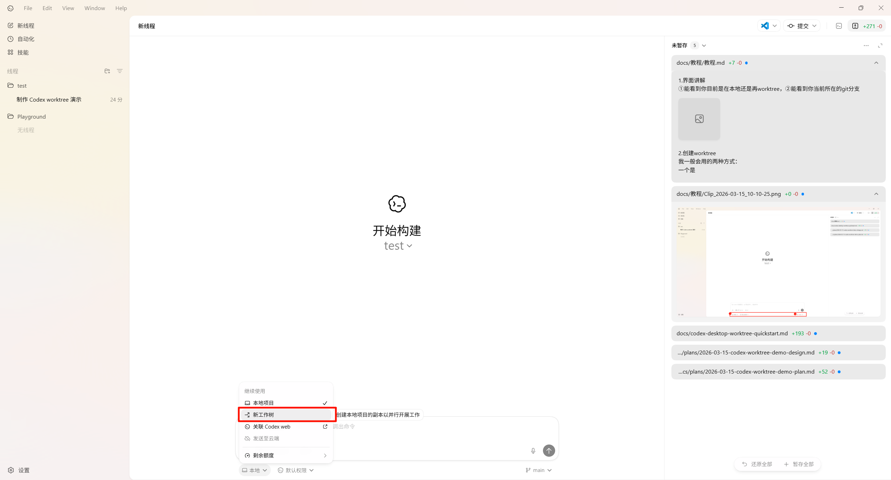
然后右下角选择环境和分支，一般默认无环境就行，分支选择你想开始工作的分支，这里我只建立了一个main分支，所以我选择了main
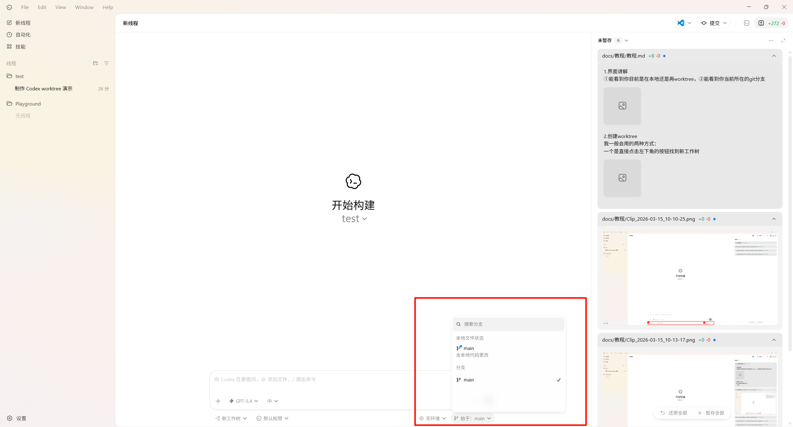
然后开始对话，codex会自动创建worktree
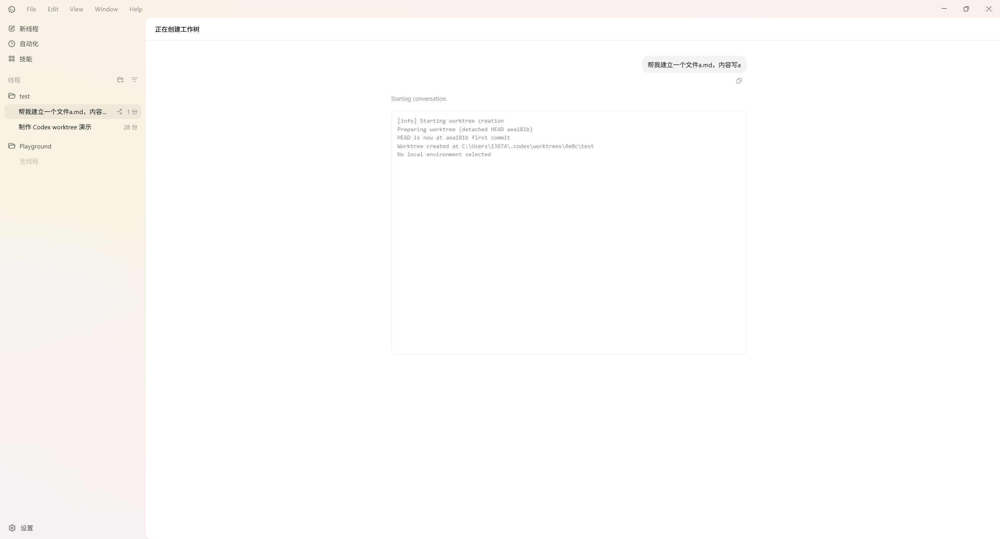
方式二：适用于要让新对话继承之前某个对话的聊天内容。
找到你想继承对话历史的那个对话，右键选择派生到新工作树
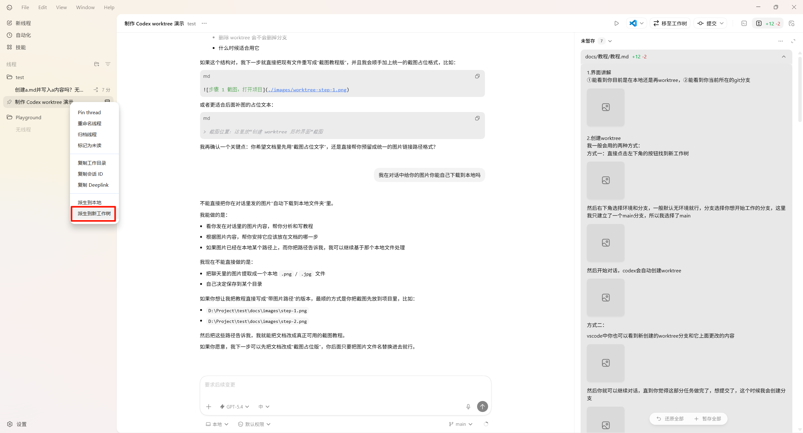 3.使用worktree
vscode中你也可以看到新创建的worktree分支和它上面更改的内容
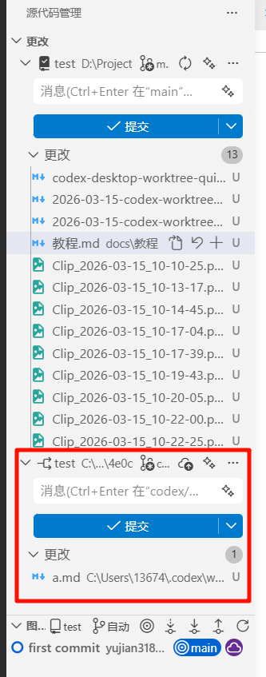
然后你就可以继续对话，直到你觉得这部分任务做完了，想提交了，这个时候我会创建分支
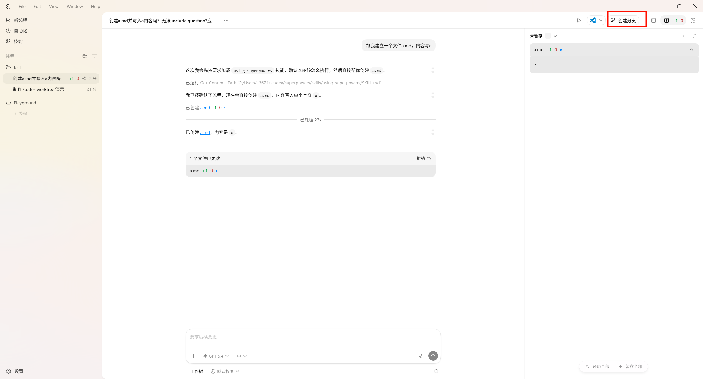
他会默认生成一个分支名，当然也可以自定义，这里我定义为a
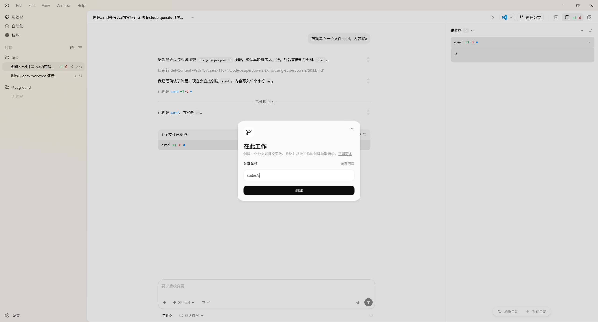

如果你想在本地先看看他更改的效果，我会选择先让本地项目签出到这个worktree分支，即点击右上角的移动到本地
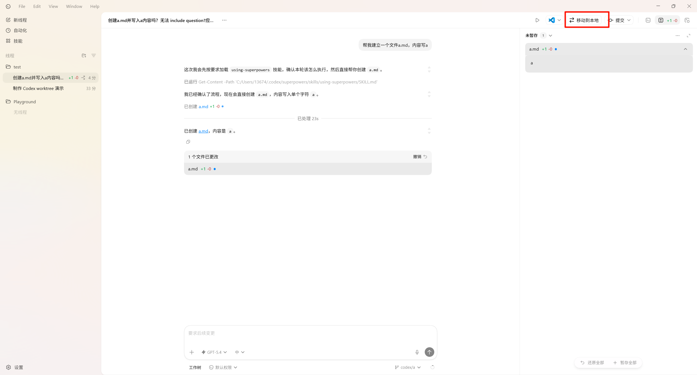
如果出现这个提示，说明你本地工作区不干净，你可以先再本地分支git stash或者进行提交以后再签出。
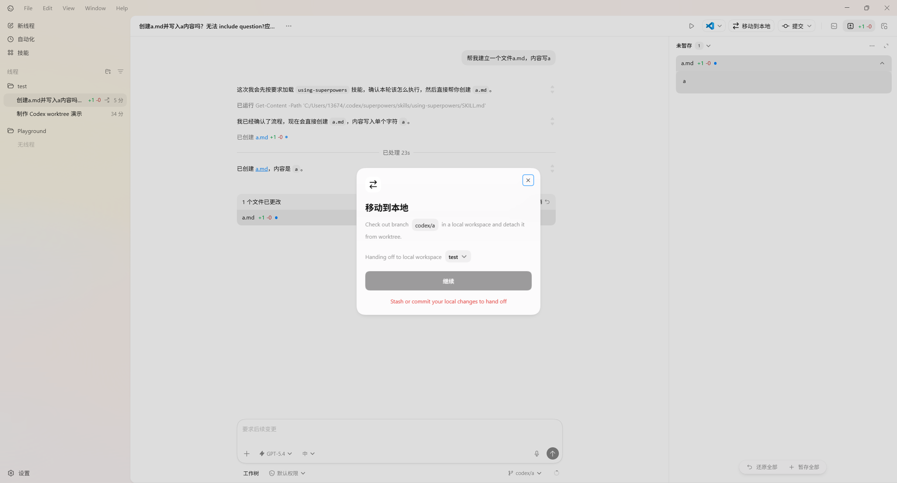
当你成功移动到本地以后，回到你刚才的聊天，你会看到左下角变成了本地，右小角的分支变成了你刚才在worktree新建的分支codex/a，右上角原先移动到本地的按钮变成了移至工作树。
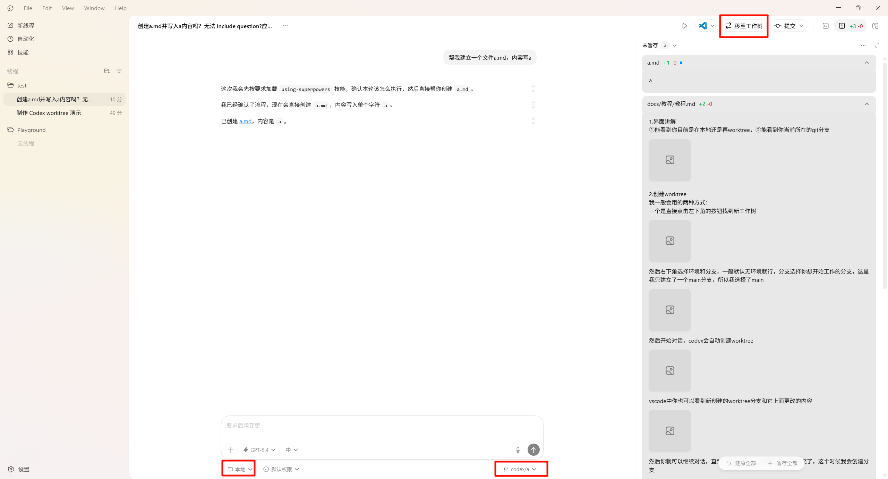
此时你可以查阅工作树上工作的结果，比如启动你的前后端查看功能之类的，然后如果不满意，你可以继续对话，此时有两种选择，一种是重新让他回到他原先的工作树，一种是在本地对话。如果是小改动，我会直接继续在对话中对话，方便直接在本地查看效果。一般如果他效果很不好，需要让他花很长时间修改，我会选择右上角移至工作树，让他重新回到他的工作树更改，我本地这样就可以空出来看别的worktree的效果。注意，移至工作树/移动到本地两个操作在它进行思考/生成代码时是不可用的，所以你需要提前决定。
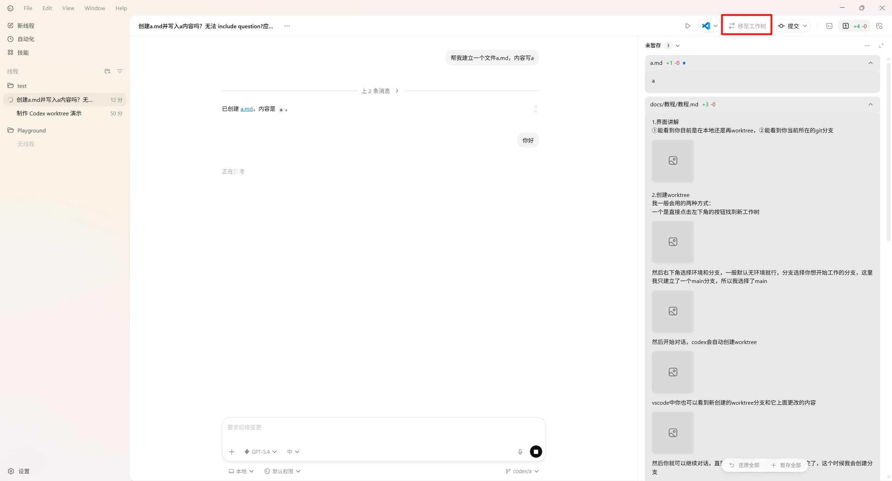

如果工作树的效果不错，你可以接纳，那么接下来就是把代码合并到你想要合并的分支上去了。这里，我要合并到main分支上去。有两种选择。
选择一：把改动移到本地的main分支。
使用git stash把更改放入储藏区，然后切换到main分支，注意我这里是在本地切换到了main分支。然后再pop出来，这样更改就都移动到了main分支。
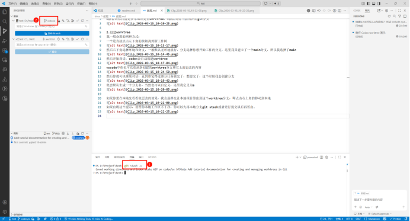
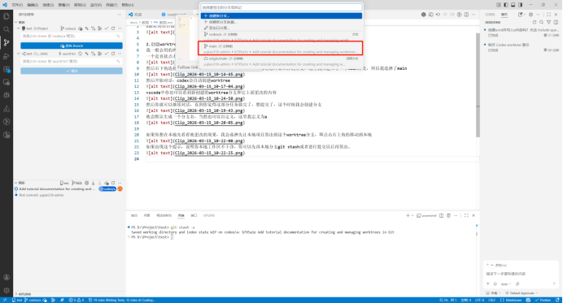
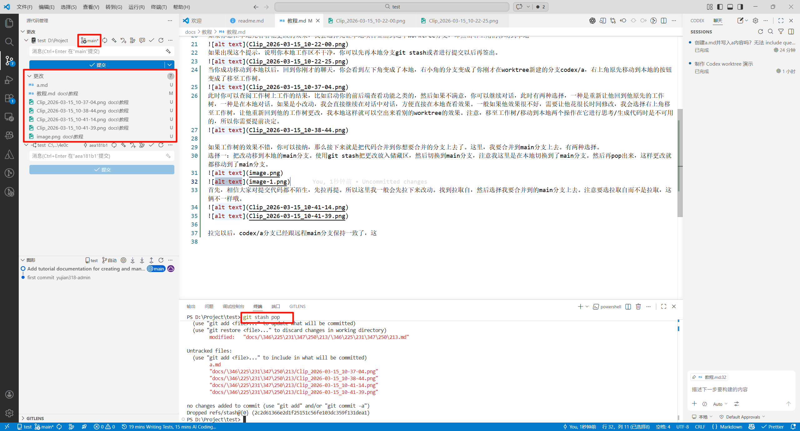
选择二：再codex/a分支直接提交，然后main分支主动合并codex/a分支。
相信大家对提交代码都不陌生，先拉再提。所以这里我一般会先拉下来改动。找到拉取自，然后选择我要合并到的main分支上去。注意要选拉取自而不是拉取，这俩不一样哦。
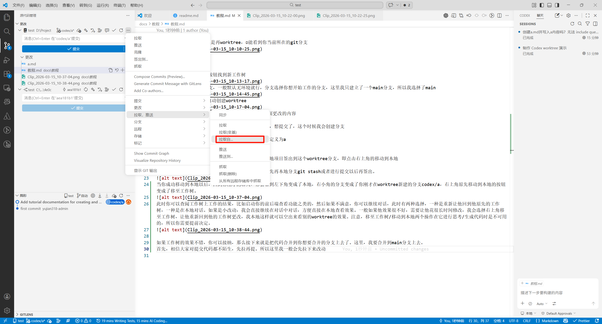
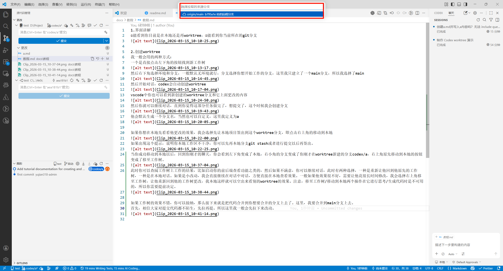

拉完以后，codex/a分支已经跟远程main分支保持一致了，然后在codex/a分支提交。提交完以后，你可以选择在codex app中选择在之前的对话中移至工作树
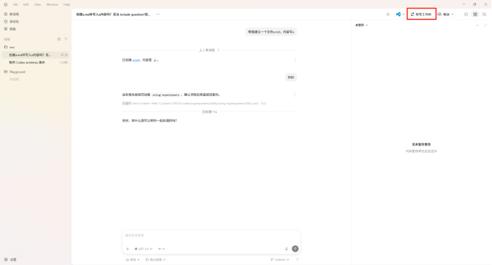
也可以通过git命令或者图形化工具自己签出到main分支。
本地签出到main分支以后，选择分支，合并，把刚才那个分支的提交合并到main上，这样更改以提交的形式也都移动到了main分支。
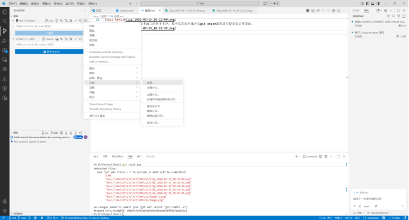
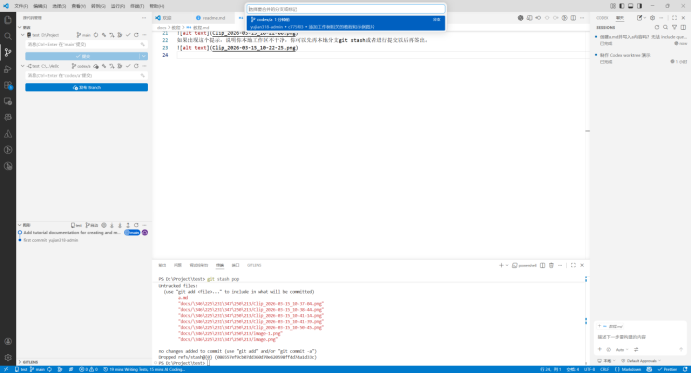
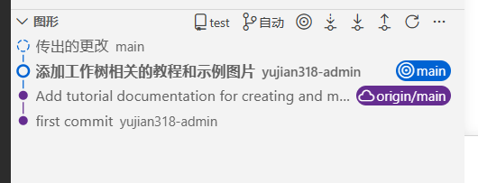
然后就正常同步更改，推送到远程分支就行了。
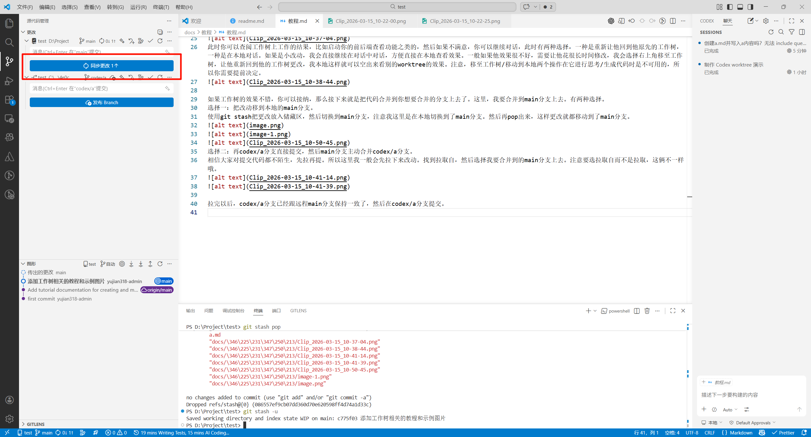

4.销毁worktree
一般我直接在vscode对应的worktree右键我想删除的工作树，选择删除工作树。
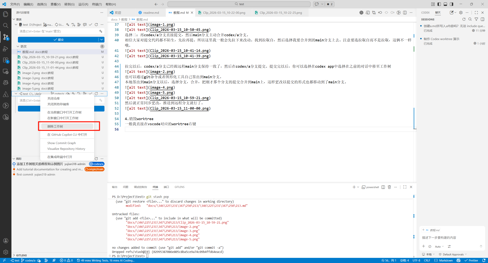
